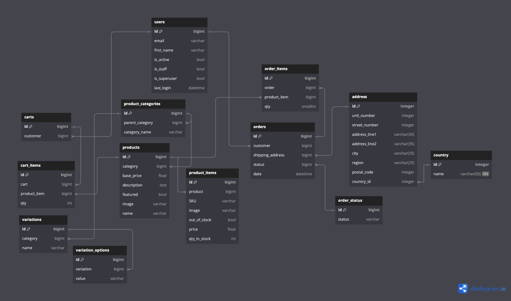

# E-Commerce App

## Project Description

The e-commerce app is a comprehensive platform designed to facilitate online shopping. It is built with a robust backend using Django and Django Rest Framework (DRF) to manage the database, user authentication, and API endpoints. [The frontend is developed using Vue.js](https://github.com/aliii010/e-commerce-vue), providing a dynamic and interactive user experience.

## Key Features

- **User Authentication:** Secure login and registration system using JWT authentication.
- **Product Management:** CRUD operations for products, allowing admins to add, edit, and delete product listings.
- **Shopping Cart:** Users can add products to their cart, view cart details, and proceed to checkout.
- **Order Management:** Users can place orders, and admins can manage and track orders.
- **Search and Filter:** Advanced search and filter options to help users find products easily.
- **Responsive Design:** Ensures a seamless experience across various devices, including desktops, tablets, and mobile phones.

## API Docs

Here is the postman API documentation: [api docs](https://documenter.getpostman.com/view/32057056/2sA3kPoim7)

## ER Diagram

